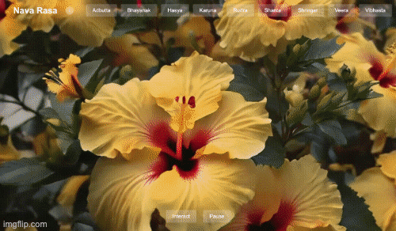

# Nava Rasa 🎭

**Nava Rasa** is an interactive web experience built with Flask that explores the **9 classical emotions (Rasas)** from Indian aesthetics. Each Rasa is brought to life through visuals and audio, offering users an immersive way to engage with emotions.

## 🌟 Features

- 🌈 Tabs for each of the **9 Rasas**:
  - Shringar (Love)
  - Hasya (Laughter)
  - Karuna (Compassion)
  - Raudra (Anger)
  - Veera (Courage)
  - Bhayanaka (Fear)
  - Vibhasta (Disgust)
  - Adbutta (Wonder)
  - Shanta (Peace)

- 🎨 Custom image and 🎵 audio for each Rasa
- 🧠 Designed for emotional exploration and learning
- ⚡️ Lightweight Flask app for easy deployment

## 📸 Demo



> Replace `path/to/your/demo.gif` with the actual path or URL to the GIF (can be local or hosted online like on Imgur or your repo)

## 🚀 Getting Started

### Prerequisites

- Python 3.7+
- pip

### Installation

```bash
# Clone the repository
git clone https://github.com/yourusername/nava-rasa.git
cd nava-rasa

# Set up virtual environment
pip install virtualenv
virtualenv fer
source fer/bin/activate   # On Windows use `fer\Scripts\activate`

# Install dependencies
pip install -r requirements.txt

# Run the Flask app
python -m flask --app ./app.py run
